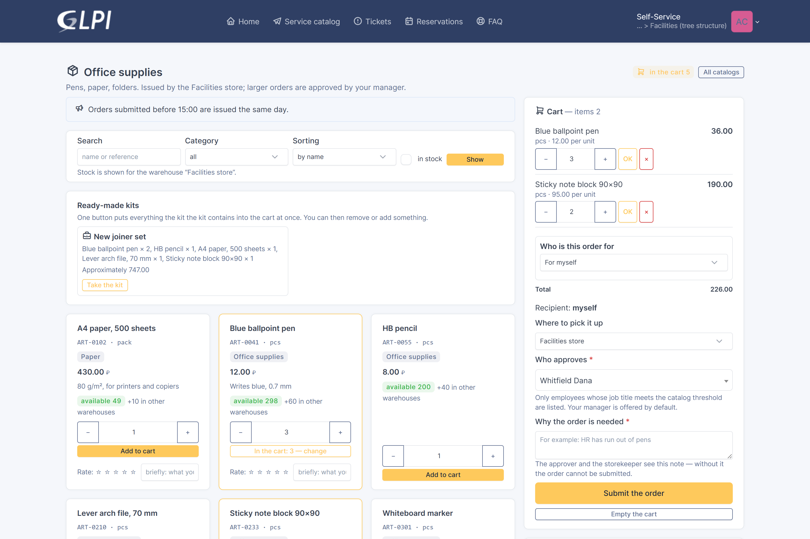
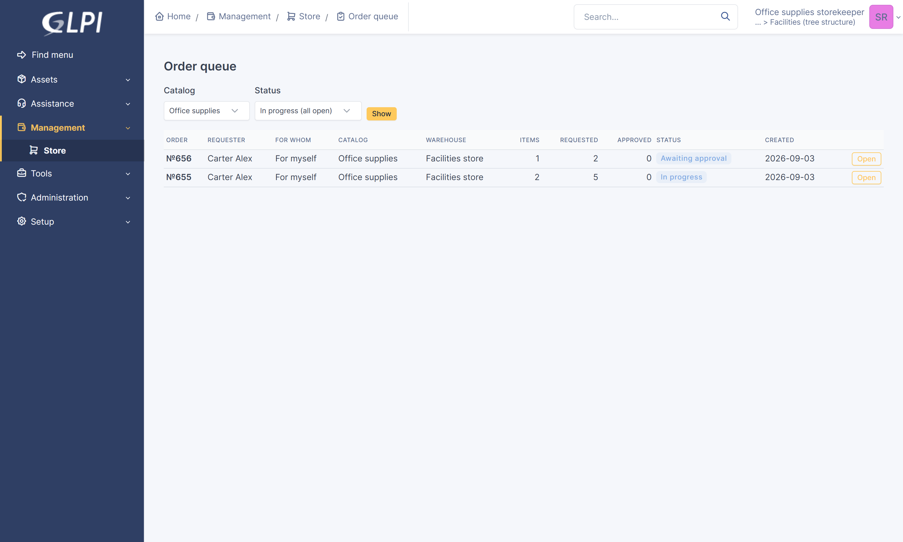
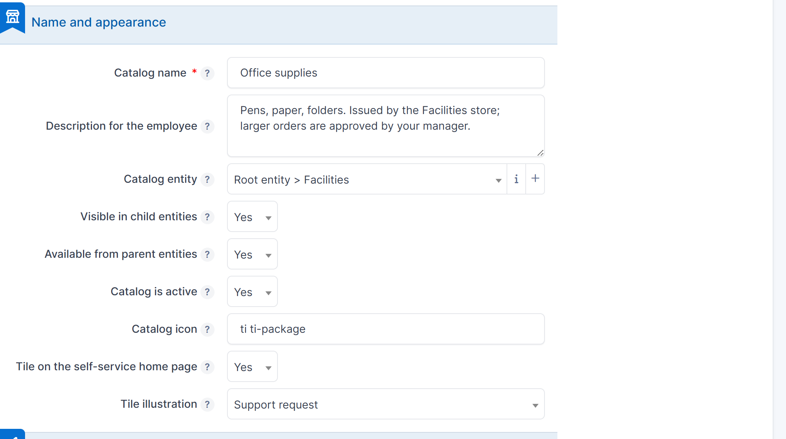
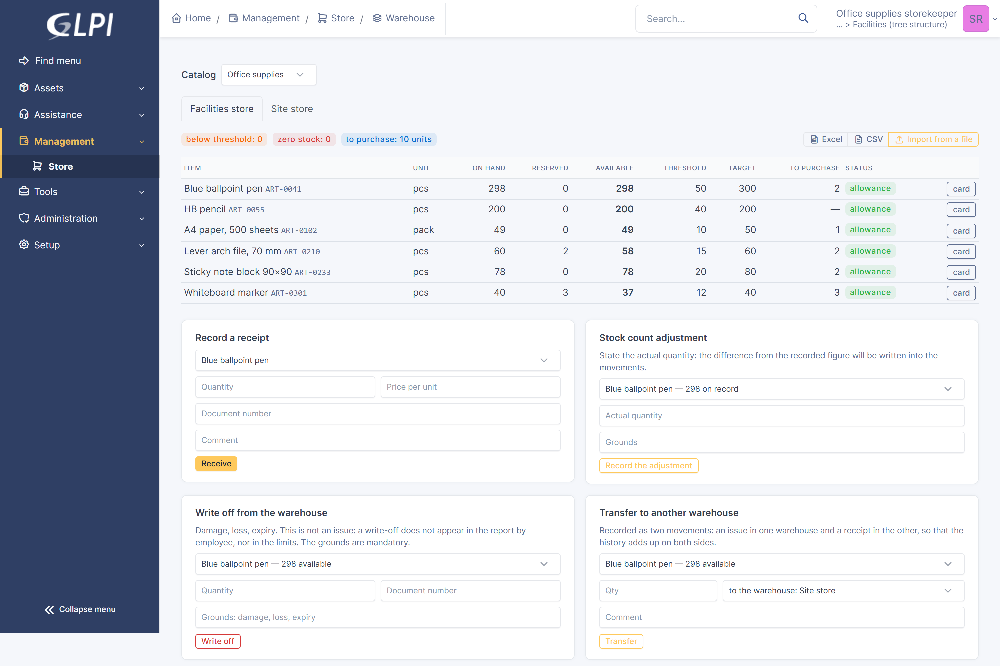
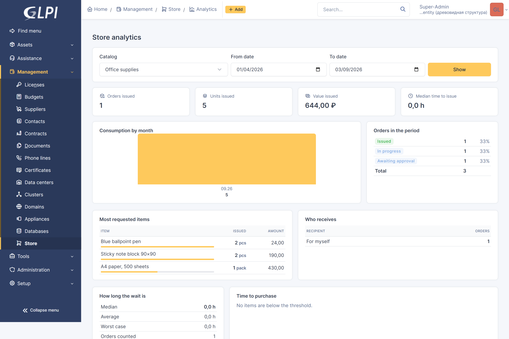

# Internal store (storefront)

*Read this in [Russian](README.ru.md) · [Документация на русском](docs/manual.md)*

A GLPI 11 plugin for issuing goods to employees: a catalog of items, a cart,
approval, a warehouse with stock and reservations, issue against a printed
note, limits and analytics.

An order lives as an ordinary GLPI ticket, so the standard lists, search,
notifications, SLA and business rules all keep working. There is no separate
portal to learn: the employee finds the store as a tile on the self-service
home page.



## Documentation

| Document | About |
|---|---|
| [docs/en/manual.md](docs/en/manual.md) | the manual: roles, objects, the process, the warehouse, limits, analytics, tasks |
| [docs/en/setup-example.md](docs/en/setup-example.md) | a catalog from scratch, step by step: entity, groups, category, SLA, rights, items, kits, limits, acceptance order |
| [docs/en/prod-checklist.md](docs/en/prod-checklist.md) | production rollout: requirements, installation, checks, pilot, upgrade, rollback |

The whole manual as one printable file, with 27 screenshots:
[docs/pdf/manual-en.pdf](docs/pdf/manual-en.pdf) (32 pages).

The same documents in Russian: [docs/manual.md](docs/manual.md),
[docs/setup-example.md](docs/setup-example.md),
[docs/prod-checklist.md](docs/prod-checklist.md),
[docs/pdf/manual-ru.pdf](docs/pdf/manual-ru.pdf).

## What it does

**The employee.** A catalog with search, categories and stock levels; a cart;
an order for themselves, a colleague, a group or an entity; a choice of pickup
warehouse; repeating a previous order; kits (a “new joiner set” — once per
person); item ratings; their own orders with progress and a printable issue
note.

**The approver.** Answers with the familiar buttons in the ticket. The
approver is picked by the employee, or determined up the manager chain with a
job title threshold, or the request goes to the catalog's approver group.

**The warehouse.** An order queue, quantity approval with a mandatory reason
when a quantity is reduced, a ready-for-pickup mark, issue with a note number,
receipts, write-offs with grounds, transfers between warehouses, stock counts,
bulk item import from a file, and export of items to CSV and Excel.

**The administrator.** Catalogs with their settings, items, warehouses, kits,
limits, job title levels, reports and analytics.

**Limits** are set per person, group, job title, entity or the whole catalog;
per month, quarter or year; soft (a warning) or hard (a block). The allowance
is chosen separately:

- **one per recipient** — the employee, the group and the entity are counted
  separately: an order for the group does not spend a personal allowance;
- **shared across the scope** — the group, the entity or the job title spends
  one pool together with its people, so taking more than the pool by ordering
  it for yourself is no longer possible.

A hard limit is checked twice: when the order is submitted and again at the
moment of issue — between those two events the person may have received their
allowance through another order.

| | |
|---|---|
|  |  |
| The storekeeper's queue | The catalog's settings |
|  |  |
| Stock and movements | Analytics |

## Requirements

- GLPI 11.0 or newer (verified on 11.0.8)
- PHP of the version your GLPI build requires
- A working GLPI task scheduler: the plugin reconciles warehouse reservations
  daily

## Installation

The directory inside `plugins/` **must be named `storefront`** — that is the
plugin's key:

```bash
cd /var/www/glpi/plugins
git clone https://github.com/<owner>/glpi-plugin-storefront.git storefront
```

Or download the archive and unpack it as `plugins/storefront`. Then install
and enable it:

```bash
php bin/console plugin:install storefront
php bin/console plugin:activate storefront
```

The schema is created on installation; the same two commands run the migration
when the version changes. Through the web interface the plugin is installed as
usual: **Setup → Plugins**.

## First setup

1. **Entity and groups.** The entity that runs the warehouse, and two groups:
   the approvers and the storekeepers.
2. **Ticket category.** A separate category for the store's tickets; a
   business rule assigns the SLA targets by it. Without a category the tickets
   are created with no targets — the catalog warns about that when saved.
3. **Rights.** An *Internal store* tab appears on the profile form with three
   rights: catalogs, orders, warehouse. The profile is assigned to a user **in
   their entity** — and that is what bounds responsibility. The storekeeper
   additionally needs GLPI rights: tickets and followups (read and update),
   and read access to consumables, ticket categories, entities, groups and
   users.
4. **The catalog.** Create the catalog, set its entity, the approver and
   fulfilment groups, the ticket category, the approval mode and the routine
   order threshold. If the employees work from the root entity, turn on
   **Available from parent entities**.
5. **Warehouse and items.** The catalog's warehouses, the items (which point
   at GLPI consumables), and the opening stock as a receipt.

A full worked example is in
[docs/en/setup-example.md](docs/en/setup-example.md).

## Entities

A catalog belongs to one entity and, by GLPI's rules, is visible inside it and
below. The **Available from parent entities** setting opens the catalog to
people working higher up the tree — sibling entities still do not see it.

The catalog's entity can be changed on its form: the warehouses, items, kits,
limits, stock, warehouse movements, orders and the home page tile all move
with it.

## The process

```
draft → awaiting approval → in the warehouse queue → approved for issue
      → ready for pickup → issued
```

A refusal by the approver and a cancellation both end the order: a solution is
added to the ticket and it moves to **Solved**. GLPI's own auto-close finishes
it later, by the delay configured for the entity; until then the employee sees
the reason and can push the ticket back if they disagree. Moving the ticket to
*Solved* on refusal can be turned off in the catalog's settings. The warehouse
reservation is released in both cases and the stock is unchanged. An issue is
indivisible: if any one item is short of stock, nothing is written off at all.

## Scheduled tasks

| Task | What it does |
|---|---|
| `storefront_lowstock` | reminds about items below the threshold |
| `storefront_cartcleanup` | removes forgotten carts |
| `storefront_reserves` | reconciles warehouse reservations against open orders |

They run in external mode, so GLPI's system cron must be working.

## Languages

The interface ships in **Russian and English**. The source strings are
Russian, and `locales/en_GB.mo` (with `en_US.mo` as a copy) translates them —
so a user whose GLPI language is English gets the English interface, and a
Russian-speaking user sees the original text. The catalogue covers all 1 050 of
the plugin's own strings: field labels, buttons, statuses, messages, rights,
reports and the printed issue note.

Two data-driven features understand both languages as well: the automatic
job title markup recognises both Russian and English titles (“Head of
department”, “Senior specialist”, “Intern”), and the item import accepts both
Russian and English column headers.

Everything an administrator types in — catalog names, item names,
announcements, the issue note's wording — is shown exactly as entered, in
whatever language it was written.

## What it does not do

- **Tracking by inventory number.** A quantity of a consumable is issued, not
  a specific numbered unit; that is why only consumables and cartridges can be
  put in a catalog, and assets (computers, monitors, phones) cannot be picked.
- **An “not in the catalog” line.** Ordering something absent from the item
  list as free text is not possible.

One behaviour worth knowing about: a limit counts the whole period, including
the issues made before the rule was created.

## Licence

GPLv3 or later — see [LICENSE](LICENSE).
