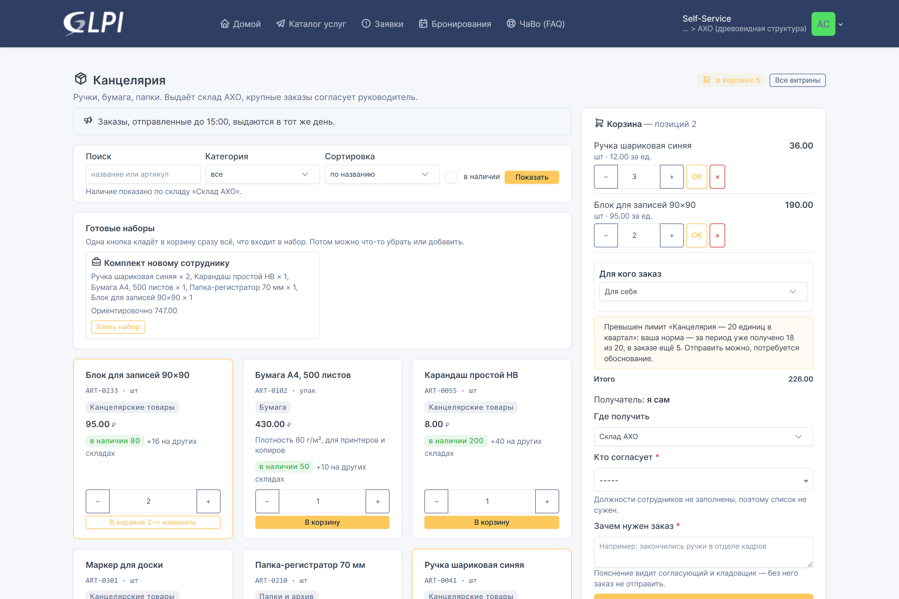
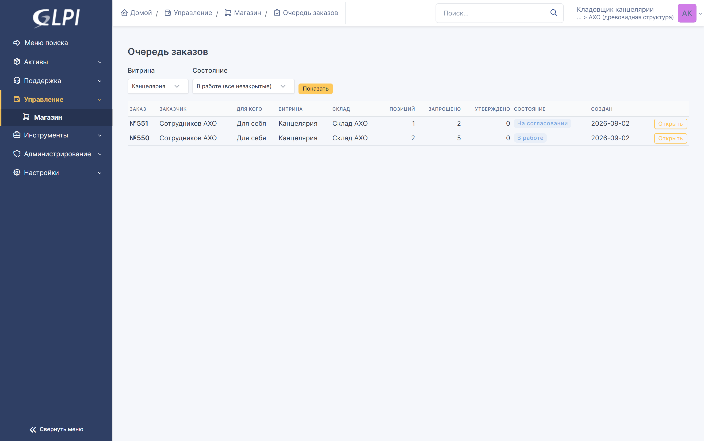
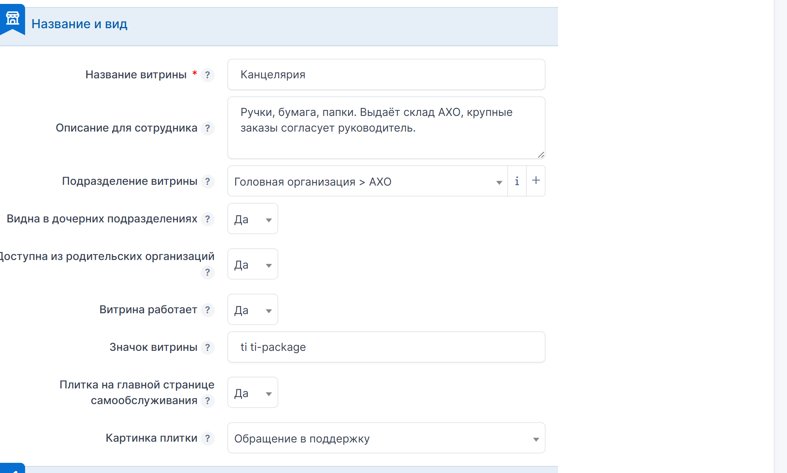
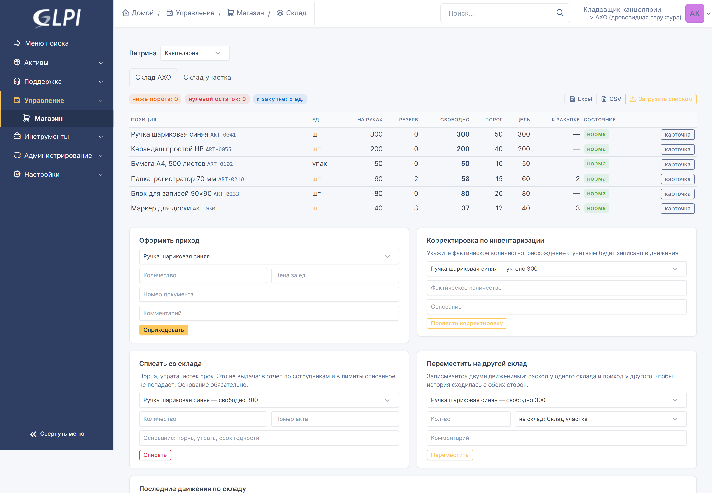
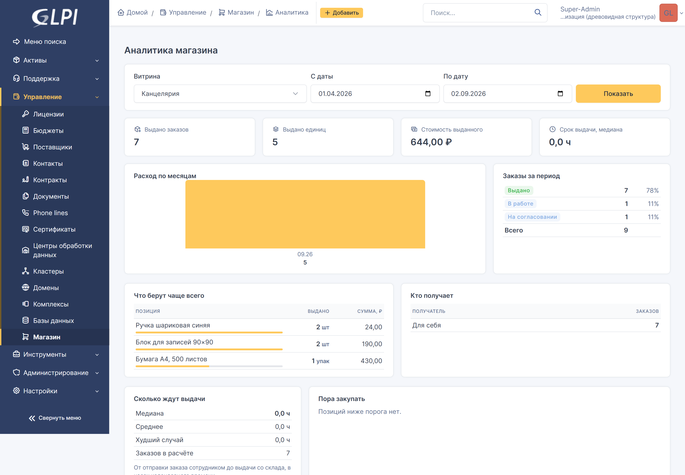

# Внутренний магазин (storefront)

*[In English](README.md) · [English documentation](docs/en/manual.md)*

Плагин GLPI 11 для выдачи материальных ценностей сотрудникам: витрина с
номенклатурой, корзина, согласование, склад с остатками и резервом, выдача
по накладной, лимиты, аналитика.

Заказ живёт как обычная заявка GLPI, поэтому работают штатные списки, поиск,
уведомления, SLA и правила. Отдельного портала учить не нужно: сотрудник
находит витрину плиткой на главной странице самообслуживания.



## Документация

| Документ | О чём |
|---|---|
| [docs/manual.md](docs/manual.md) | руководство: роли, объекты, процесс, склад, лимиты, аналитика, задания |
| [docs/setup-example.md](docs/setup-example.md) | витрина с нуля пошагово: организация, группы, категория, SLA, права, товары, наборы, лимиты, приёмочный заказ |
| [docs/prod-checklist.md](docs/prod-checklist.md) | выкатка на рабочий контур: требования, установка, проверка, пилот, обновление, откат |

Всё руководство одним печатным файлом, со скриншотами:
[docs/pdf/manual-ru.pdf](docs/pdf/manual-ru.pdf) (32 страницы).

Те же документы по-английски: [docs/en/manual.md](docs/en/manual.md),
[docs/en/setup-example.md](docs/en/setup-example.md),
[docs/en/prod-checklist.md](docs/en/prod-checklist.md),
[docs/pdf/manual-en.pdf](docs/pdf/manual-en.pdf).

## Что умеет

**Сотрудник.** Витрина с поиском, категориями и остатками; корзина; заказ для
себя, коллеги, отдела или подразделения; выбор склада получения; повтор
прошлого заказа; наборы («стартовый набор» — один раз на человека); оценки
позиций; свои заказы с ходом выполнения и печатной накладной.

**Согласующий.** Отвечает привычными кнопками в заявке. Согласующего выбирает
сам сотрудник, либо он определяется по цепочке руководителей с порогом
должности, либо запрос уходит группе согласующих витрины.

**Склад.** Очередь заказов, подтверждение количеств с обязательной причиной при
уменьшении, отметка готовности, выдача с номером накладной, приход, списание с
основанием, перемещение между складами, инвентаризация, загрузка номенклатуры
из файла, выгрузка позиций в CSV и Excel.

**Администратор.** Витрины с настройками, номенклатура, склады, наборы, лимиты,
уровни должностей, отчёты и аналитика.

**Лимиты** задаются на человека, отдел, должность, подразделение или всю витрину;
за месяц, квартал или год; мягкие (предупреждение) и жёсткие (запрет). Отдельно
выбирается норма:

- **у каждого своя** — сотрудник, отдел и подразделение считаются порознь: заказ
  на отдел личную норму не расходует;
- **одна на всю область** — отдел, подразделение или должность расходуют общий
  запас вместе со своими людьми, и получить сверх него, оформив выдачу на себя,
  уже нельзя.

Жёсткий лимит проверяется дважды: при отправке заказа и ещё раз в момент выдачи —
между этими событиями человек мог получить норму по другому заказу.

| | |
|---|---|
|  |  |
| Очередь кладовщика | Настройки витрины |
|  |  |
| Остатки и движения | Аналитика |

## Требования

- GLPI 11.0 и новее (проверено на 11.0.8)
- PHP той же версии, что требует ваша сборка GLPI
- Работающий планировщик заданий GLPI: плагин ежедневно сверяет резерв склада

## Установка

Каталог внутри `plugins/` **должен называться `storefront`** — это ключ
плагина:

```bash
cd /var/www/glpi/plugins
git clone https://github.com/<owner>/glpi-plugin-storefront.git storefront
```

Либо скачайте архив и распакуйте его как `plugins/storefront`. Затем
установите и включите:

```bash
php bin/console plugin:install storefront
php bin/console plugin:activate storefront
```

Схема создаётся при установке; при обновлении версии те же команды выполняют
миграцию. Через веб-интерфейс плагин ставится обычным порядком:
**Настройки → Плагины**.

## Первичная настройка

1. **Организация и группы.** Организация, которая ведёт склад, и две группы:
   согласующие и кладовщики.
2. **Категория заявок.** Отдельная категория для заявок магазина; правило заявок
   назначает по ней сроки SLA. Без категории заявки создаются без сроков —
   витрина предупредит при сохранении.
3. **Права.** На форме профиля появляется вкладка **«Внутренний магазин»** с
   тремя правами: витрины, заказы, склад. Профиль назначается сотруднику
   **в его организации** — этим и ограничивается зона ответственности.
   Кладовщику дополнительно нужны права GLPI: заявки и сопровождение (чтение и
   изменение), расходные материалы, категории заявок, организации, группы,
   пользователи — на чтение.
4. **Витрина.** Создать витрину, указать подразделение, группы согласующих и
   исполнителей, категорию заявок, режим согласования и порог рутинных заказов.
   Если сотрудники работают из корневой организации, включить
   **«Доступна из родительских организаций»**.
5. **Склад и номенклатура.** Склады витрины, позиции (ссылаются на расходные
   материалы GLPI), начальные остатки приходом.

Полный разобранный пример — в [docs/setup-example.md](docs/setup-example.md).

## Организации

Витрина принадлежит одной организации и по правилам GLPI видна внутри неё и
ниже. Настройка **«Доступна из родительских организаций»** открывает витрину
тем, кто работает выше по дереву — соседние организации её всё равно не видят.

Подразделение витрины можно изменить в её форме: вместе с витриной переезжают
склады, номенклатура, наборы, лимиты, остатки, проводки склада, заказы и плитка
на главной странице.

## Процесс

```
черновик → на согласовании → в очереди склада → утверждён к выдаче
        → готов к выдаче → выдан
```

Отклонение согласующим и отмена завершают заказ: к заявке прикладывается
решение, и она переходит в **«Решена»**. Закрывает её потом штатное автозакрытие
GLPI — по сроку, заданному в организации; до этого сотрудник видит причину и при
несогласии может вернуть заявку в работу. Перевод в «Решена» при отказе
выключается настройкой витрины. Резерв со склада снимается в обоих случаях,
остаток не меняется. Выдача неделима: если по одной позиции не хватает остатка,
не списывается ничего.

## Задания планировщика

| Задание | Что делает |
|---|---|
| `storefront_lowstock` | напоминает о позициях ниже порога |
| `storefront_cartcleanup` | убирает забытые корзины |
| `storefront_reserves` | сверяет резерв склада с резервом открытых заказов |

Задания работают во внешнем режиме, поэтому нужен работающий системный cron
GLPI.

## Языки

Интерфейс поставляется на **русском и английском**. Исходные строки русские, их
переводит `locales/en_GB.mo` (и его копия `en_US.mo`): пользователь с
английским языком GLPI получает английский интерфейс, русскоязычный видит
исходный текст. Каталог покрывает все 1 050 собственных строк плагина — подписи
полей, кнопки, состояния, сообщения, права, отчёты и печатную накладную.

Двуязычны и две функции, работающие с данными: автоматическая разметка
должностей узнаёт и русские, и английские названия («Начальник отдела»,
«Head of department», «Senior specialist»), а загрузка номенклатуры принимает
как русскую, так и английскую шапку файла.

Всё, что вводит администратор — названия витрин и позиций, объявления, текст
накладной, — показывается ровно так, как введено, на любом языке.

## Чего плагин не делает

- **Учёт по инвентарным номерам.** Выдаётся расходное количество, а не
  конкретный экземпляр с номером; поэтому в витрину заводятся только расходные
  материалы и картриджи: активы (компьютеры, мониторы, телефоны) выбрать
  нельзя.
- **Позиция «нет в каталоге».** Заказать свободным текстом то, чего нет в
  номенклатуре, нельзя.

Особенность, о которой стоит знать: лимит считает период целиком, включая
выдачи, сделанные до того, как правило завели.

## Лицензия

GPLv3 или новее — см. [LICENSE](LICENSE).
