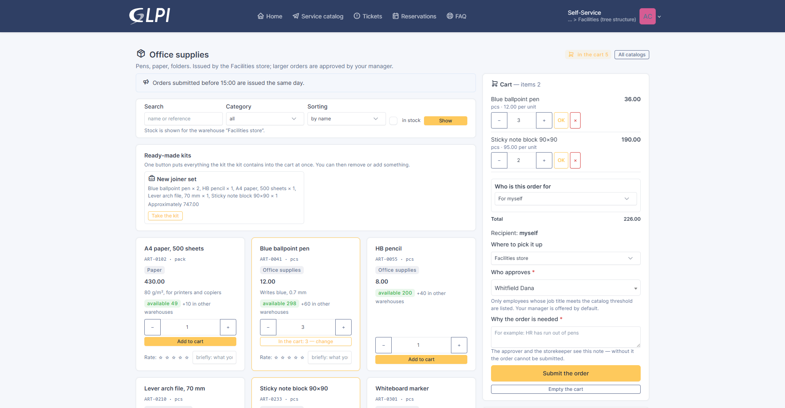
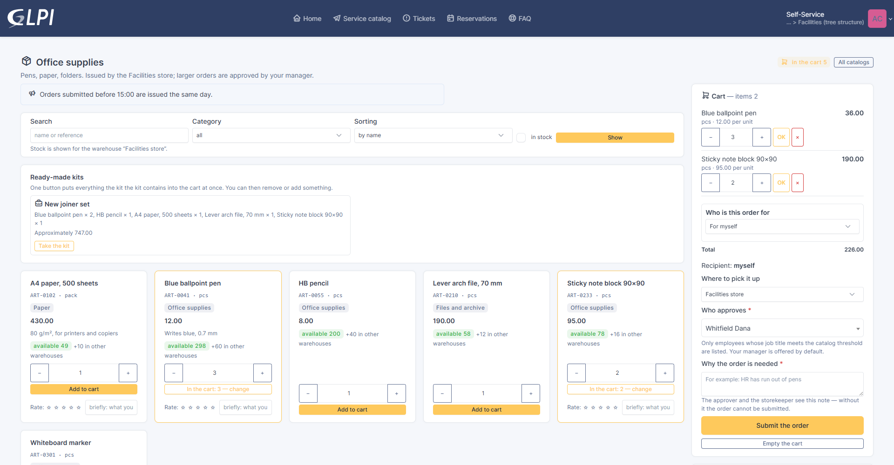
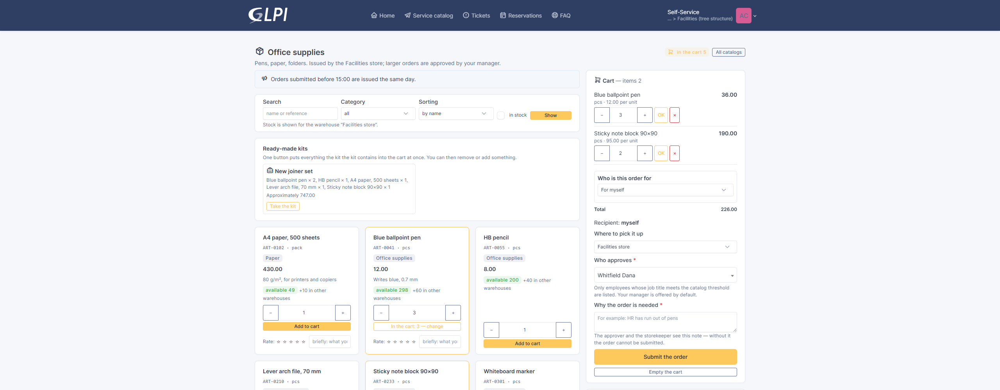
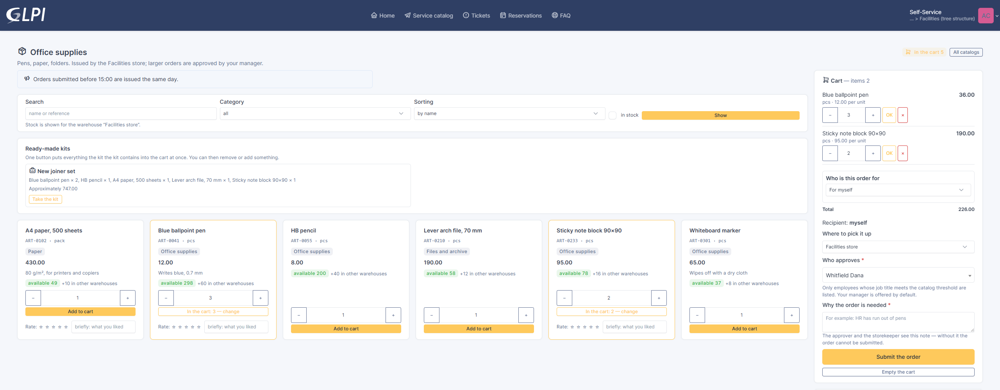

# The catalog at full page width

GLPI's self-service keeps page content within 1320 px. On a wide monitor the
catalog occupies the middle of the screen and the sides stay empty: at 1920 px
that is 300 px on each side. For a catalog with a large assortment this means
three times more scrolling than necessary.

The catalog setting **Full page width** lifts that limit — for one particular
catalog and only on that catalog's page. The rest of the self-service interface
is unchanged.

## How to turn it on

**Management → Store → Store catalogs → the catalog → the “Name and
appearance” section**:

The setting is off by default, so upgrading the plugin changes nothing for
catalogs that are already configured. Each catalog has its own switch: you can
leave office supplies as they are and widen an equipment catalog with a hundred
items.

## What changes

Width alone would not have been enough: a long line of text is hard to read,
and the cart would have turned into an empty field on the right. So the grid
changes with it:

- **long text** — the catalog description and the announcement — stays within a
  readable line (104 characters) instead of stretching across the screen;
- **the cart** narrows to 18–22 % of the width instead of 33 %, while staying
  readable;
- **item cards** go four per row from 1600 px, five from 1920 px and six from
  2560 px;
- **below 1400 px** nothing changes: on a laptop, a tablet and a phone the
  layout stays as it is.

### 1920 px (Full HD)

Before — content 1320 px, three cards per row:

After — content 1920 px, five cards per row:

### 2560 px (2K)

Before:

After — six cards per row; the whole example assortment fits without
scrolling:

## Measurements

The numbers were taken from a running catalog rather than estimated by eye.
“Per row” is how many item cards sit in one line, “line” is the width of the
longest line of text, “overflow” is horizontal page scrolling (there must be
none).

| Resolution | Off: content / per row / line | On: content / per row / line | Overflow |
|---|---|---|---|
| 375 (phone) | 375 / 1 / 343 | unchanged | 0 |
| 768 (tablet) | 768 / 2 / 736 | unchanged | 0 |
| 1366 (laptop) | 1140 / 3 / 1076 | unchanged | 0 |
| 1600 | 1320 / 3 / 1256 | **1600 / 4 / 910** | 0 |
| 1920 (Full HD) | 1320 / 3 / 1256 | **1920 / 5 / 910** | 0 |
| 2560 (2K) | 1320 / 3 / 1256 | **2560 / 6 / 910** | 0 |

With the setting on, a card stays a comfortable 288–340 px wide against 283 px
today — the items do not become smaller.

## How it is done

The plugin prints a few CSS rules **only on its own catalog page** and only
when the setting is on. GLPI's files and templates are not modified and no
layout is forked: the rule overrides the standard `container-xl` class that
GLPI uses to cap the width in self-service.

If a future GLPI version renames that class, the rule simply stops applying and
the catalog returns to today's look — with no errors and no code changes.
