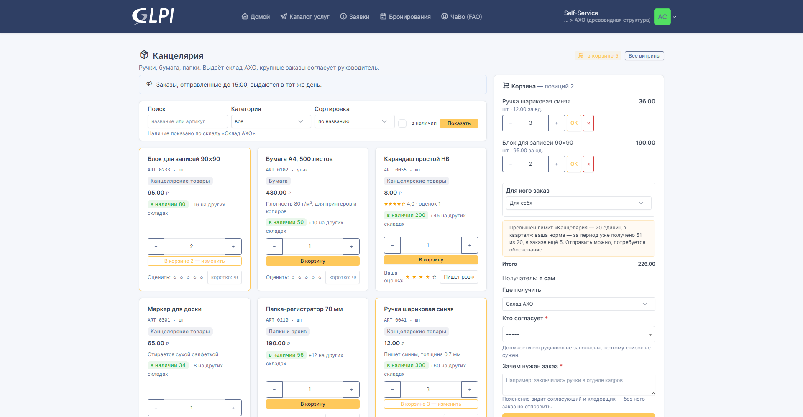
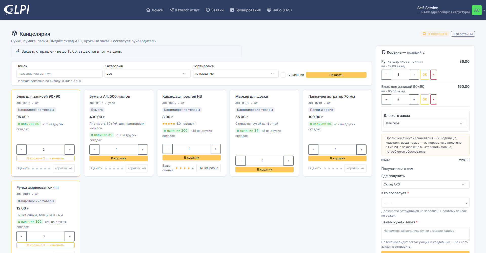
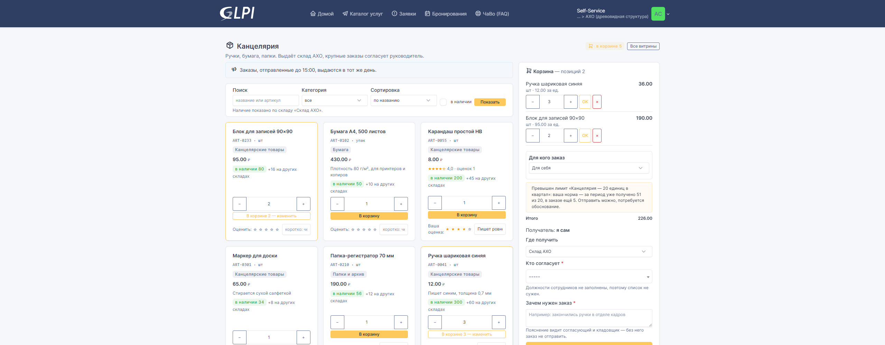
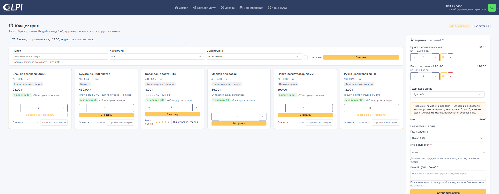

# Витрина во всю ширину страницы

Самообслуживание GLPI держит содержимое страницы в 1320 точках. На широком
мониторе витрина занимает середину экрана, а по краям остаётся пустота: при
1920 точках — по 300 с каждой стороны. Для витрины с большим ассортиментом это
означает втрое более длинную прокрутку.

Настройка витрины **«Во всю ширину страницы»** снимает это ограничение — для
одной конкретной витрины и только на её странице. Остальные страницы
самообслуживания не меняются.

## Как включить

**Управление → Магазин → Витрины магазина → витрина → раздел «Название и вид»**:

Поля нет на форме? Значит GLPI отдаёт форму из кеша скомпилированных
шаблонов — так бывает при обновлении с версий до 1.0.0-rc8. Лечится командой
`php bin/console cache:clear`, а на 1.0.0-rc8 и новее — выключением и
включением плагина.

По умолчанию настройка выключена, поэтому обновление плагина ничего не меняет
у уже настроенных витрин. Переключатель у каждой витрины свой: можно оставить
канцелярию как есть, а витрину техники с сотней позиций расширить.

## Что меняется

Одной ширины было бы мало: длинная строка текста читается тяжело, а корзина
превратилась бы в пустое поле справа. Поэтому вместе с шириной правится сетка:

- **длинный текст** — описание витрины и объявление — остаётся в читаемой
  строке (104 знака) вместо растягивания на весь экран;
- **корзина** сужается до 18–22 % ширины вместо 33 %, оставаясь читаемой;
- **карточки позиций** идут по четыре в ряду с 1600 точек, по пять с 1920 и по
  шесть с 2560;
- **до 1400 точек** ничего не меняется: на ноутбуке, планшете и телефоне вид
  остаётся штатным.

### 1920 точек (FullHD)

Было — содержимое 1320 точек, три карточки в ряду:

Стало — содержимое 1920 точек, пять карточек в ряду:

### 2560 точек (2K)

Было:

Стало — шесть карточек в ряду, весь ассортимент примера виден без прокрутки:

## Замеры

Числа сняты с работающей витрины, а не оценены на глаз. «В ряду» — сколько
карточек позиций стоит в одной строке, «строка» — ширина самой длинной строки
текста, «прокрутка» — горизонтальная прокрутка страницы (её быть не должно).

| Разрешение | Выключено: содержимое / в ряду / строка | Включено: содержимое / в ряду / строка | Прокрутка |
|---|---|---|---|
| 375 (телефон) | 375 / 1 / 343 | без изменений | 0 |
| 768 (планшет) | 768 / 2 / 736 | без изменений | 0 |
| 1366 (ноутбук) | 1140 / 3 / 1076 | без изменений | 0 |
| 1600 | 1320 / 3 / 1256 | **1600 / 4 / 910** | 0 |
| 1920 (FullHD) | 1320 / 3 / 1256 | **1920 / 5 / 910** | 0 |
| 2560 (2K) | 1320 / 3 / 1256 | **2560 / 6 / 910** | 0 |

Ширина карточки при включённой настройке остаётся в удобных пределах —
288–340 точек против 283 сейчас, то есть позиции не становятся мельче.

## Как это сделано

Плагин печатает несколько правил CSS **только на странице своей витрины** и
только когда настройка включена. Файлы и шаблоны GLPI не меняются, свой макет
не форкается: правило перекрывает штатный класс `container-xl`, которым GLPI
ограничивает ширину в самообслуживании.

Если в будущей версии GLPI этот класс переименуют, правило просто перестанет
действовать, и витрина вернётся к нынешнему виду — без ошибок и без правки
кода.
